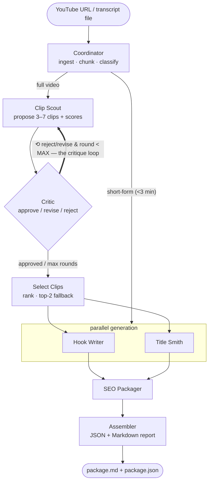

# Content Repurposing Agent

**Give it one YouTube URL. Get back a complete content package — ranked Shorts/Reels clips, hooks, titles, thumbnail text, and SEO — produced by a team of AI agents with a self-critiquing feedback loop.**

Built with **LangGraph + FastAPI + Groq**, instrumented with **Langfuse** tracing and a persisted job store. Used in production for the *Alpha Zone* YouTube channel (football + AI).

> ### ⚠️ Please read: about the live demo
> The web UI is **fully working**. However, YouTube blocks requests coming from cloud/hosted servers, so on the **live (hosted) site the "paste a YouTube URL" feature will not work** — you can't generate clips from a URL there.
>
> **To generate clips from a YouTube URL, run this project on your own computer (local server), where it works perfectly.** On the live site, you can still use the **"Upload transcript"** button, which works everywhere. See [Quickstart](#quickstart) to run it locally.

---

## Why this is a real agent, not a fancy script

The heart of the system is a **self-critique loop with conditional graph routing**:

- **Clip Scout** proposes the 3–7 best clips, each *scored* on hook potential, completeness, and shareability.
- **Critic** reviews every pick against explicit criteria and returns `approve` / `revise` / `reject`.
- Rejected/revised picks are sent **back to the Clip Scout with feedback** (max 2 rounds) — a genuine agentic loop, not a linear chain.
- The **Coordinator** routes conditionally: a sub-3-minute video skips clip selection entirely.
- Agents don't just generate — they **score, rank, and reject**. The output tells you *"I chose these 4 clips and rejected these 2 because X."*

## Architecture



The bold `critic → clip_scout` back-edge is the critique loop — visible as repeated spans in every Langfuse trace.

## What you get

A copy-paste-ready `outputs/{video_id}/package.md` (+ `package.json`):

- **Clips** — timestamped ranges, why each was chosen, virality scores
- **Hooks** — 3 styles per clip (curiosity, bold claim, question), ≤12 words
- **Titles** — 5 for the main video + 3 per clip (≤60 chars), CTR-optimized
- **Thumbnail text** — 2–4 punchy ALL-CAPS words per clip
- **SEO** — description with chapter timestamps, ≤15 tags, ≤8 hashtags, Shorts + Reels captions
- **Rejected clips** with the Critic's reasons, and a per-job cost summary

<details>
<summary><b>Example output</b> (real, from a 3Blue1Brown video)</summary>

```markdown
# Content Package — aircAruvnKk
**Duration:** 18:26 · **Clips:** 3 approved / 6 proposed (2 critique rounds)

## Main Video Titles
- Unlocking Neural Networks for Handwritten Digits
- How Neural Networks Recognize Handwritten Digits
- The Power of Neural Networks in Digit Recognition

### #1 · 06:22–07:14 (52s) — score 24/30
> Recognizing a loop can also break down into subproblems. One reasonable way
> to do this would be to first recognize the various little edges that make it up.
*Why:* Clear explanation of loop recognition

**Hooks:**
- _curiosity_: Breaking down loops into subproblems can be a game changer
- _bold_claim_: Recognizing loops is key to solving complex problems
- _question_: How do we break down complex loops into simpler parts

**Thumbnail text:** EDGE DETECTION · LOOP RECOGNITION · SUBPROBLEMS
```
</details>

## Quickstart

### Local

```bash
python3.12 -m venv .venv && source .venv/bin/activate   # Python 3.12 (LangGraph compat)
pip install -r requirements.txt
cp .env.example .env                                     # add your free Groq key
# LLM_API_KEY=gsk_...   (free: https://console.groq.com/keys)

uvicorn app.main:app --reload
```

Then open **http://localhost:8000** for the web UI — paste a URL, watch the agent
pipeline run live, and get the rendered package with one-click copy buttons for
the description, tags, and captions. Or use the API directly:

```bash
# Submit a video
curl -X POST localhost:8000/process -H 'content-type: application/json' \
  -d '{"video_url":"https://www.youtube.com/watch?v=<id>"}'
# → {"job_id":"job_...","status":"queued"}

curl localhost:8000/jobs/job_...      # poll until "done" → full package
curl localhost:8000/stats             # approval rate, cost/video, videos processed
open outputs/<video_id>/package.md    # the report you actually use
```

You can also upload a local transcript instead of a URL:
```bash
curl -X POST localhost:8000/process -F "file=@transcript.srt"
```

### Docker

```bash
docker build -t content-agent .
docker run -p 8000:8000 -e LLM_API_KEY=gsk_... content-agent
```

## Evaluation

Real ground truth on my own channel: I hand-mark the genuinely best clips per video, then measure how well the agent recovers them.

```bash
python evals/run_evals.py          # recall + precision + critic ON/OFF ablation + LLM-judge
```

Example scorecard (placeholder golden set — replace with your own marks):

```
fixture            rec ON  rec OFF  prec ON  prec OFF   clips ON/OFF
--------------------------------------------------------------------------
AVERAGE              38%      62%      35%       33%
--------------------------------------------------------------------------
LLM-as-judge (avg 1-10): hook truthfulness 8.0 · title truthfulness 9.0 · title CTR 8.0
```

**The critic ablation, honestly.** Recall alone *drops* with the critic on (62%→38%) — but that's a metric artifact: critic-off keeps 6 clips vs the critic's 2–5, so it mechanically covers more ground. Recall rewards over-selecting. **Precision** — did we pick the *right* clips — *improves* with the critic (33%→35%). The self-critique loop trades quantity for quality, which is exactly its job. Mark real ground truth (`evals/golden_set.json`) to get numbers that mean something for your channel.

## Design decisions

- **Why a critic loop?** A single-pass generator has no way to catch its own weak picks. The critic enforces explicit quality criteria and forces revision — and the ablation lets me *measure* its effect instead of assuming it.
- **Structured outputs everywhere.** Every agent returns a Pydantic-typed object via `with_structured_output` — no regex parsing of free text. Timestamps are additionally validated *in code* against transcript bounds (clamp to 15–75s), so a hallucinated timestamp can't leak through.
- **Graceful degradation.** Each node is wrapped so one agent failing records an error and the pipeline still completes. The LLM layer distinguishes a *daily* rate cap (cool the model down, fall back to a smaller one) from a transient *per-minute* spike (brief sleep + retry the same, more capable model) — so long videos aren't forced onto a model that can't fit them. Guardrails hard-trim any over-length output.
- **Long-video support (map-reduce).** The Clip Scout splits a long transcript into chunks that each fit the free-tier per-request limit, finds the best clips in every chunk (the *map*), then keeps the top ones overall (the *reduce*). This handles videos up to ~1.5–2 hours without any single request exceeding the token cap — verified on a 1h56m video whose clips span the whole runtime.
- **Cost & observability.** Every job is one Langfuse trace with a span per agent (the critique loop is visible as repeated spans); token usage is accumulated across *all* attempts and persisted to a SQLite job store that powers `/stats`.

## Endpoints

| Method | Path | Purpose |
|--------|------|---------|
| `GET`  | `/` | single-page web UI |
| `GET`  | `/health` | liveness + config |
| `POST` | `/process` | start a job (JSON `{video_url}` or multipart file); dedupes completed URLs |
| `GET`  | `/jobs/{id}` | status + full package when done |
| `GET`  | `/stats` | videos processed, approval/rejection rate, avg cost/video |

## Deploying (and the YouTube-blocking caveat)

The Dockerfile binds to `$PORT`, so it deploys as-is to Render, Fly.io, Cloud
Run, or Hugging Face Spaces — set `LLM_API_KEY` (and optional Langfuse keys) as
environment variables in the host dashboard.

**One production gotcha:** YouTube throttles/blocks datacenter IPs, so fetching a
transcript *by URL* often fails on hosted servers (you'll get a clear
`IpBlocked` message). Two robust paths handle this:

1. **Upload a transcript file** (`.srt`/`.txt`/`.json`) — needs no YouTube access
   at all, so it works on any server. This is the default reliable path in the UI.
2. **Set a residential proxy** — the fetcher reads `YOUTUBE_PROXY_USERNAME` /
   `YOUTUBE_PROXY_PASSWORD` (Webshare) or `YOUTUBE_HTTP_PROXY`, so URL fetching
   works from the cloud too.

Running locally (a residential IP) needs neither.

## Tech stack

Python 3.12 · LangGraph · LangChain · Groq (`llama-3.3-70b-versatile`, free tier) · FastAPI · Pydantic v2 · youtube-transcript-api · yt-dlp · Langfuse · SQLite · pytest · Docker

See [architecture.md](architecture.md) for the graph internals, the critique loop, conditional routing, and failure handling.
