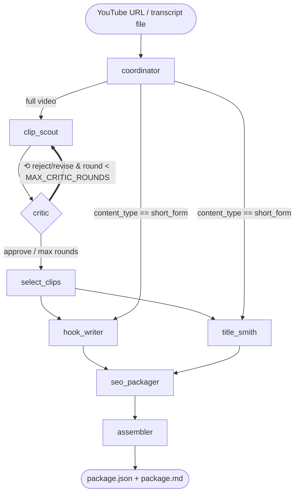

# Architecture

## The graph

State flows through a single `ContentState` TypedDict (see `app/agents/state.py`).
List/dict channels written by the parallel branch use reducers so `hook_writer`
and `title_smith` can update state concurrently without clobbering each other.

## The critique loop

This is what makes the system an agent rather than a pipeline. After `clip_scout`
proposes scored clips, `critic` evaluates each against explicit criteria
(self-contained, 20–60s, strong open, complete ending, honest scoring) and emits
a per-clip verdict: `approve`, `revise`, or `reject`.

A **conditional edge** (`make_route_after_critic`) inspects the verdicts:

- if any verdict is `reject`/`revise` **and** `critic_round < MAX_CRITIC_ROUNDS`
  → route back to `clip_scout`, which receives its previous picks *plus every
  critic note* and must address them;
- otherwise → route to `select_clips`.

The loop is bounded by `MAX_CRITIC_ROUNDS` (default 2). If the critic rejects
everything even at the round limit, `select_clips` falls back to the top-2 clips
by score and records a warning — the pipeline always completes.

In a Langfuse trace this loop is visible directly: `clip_scout` and `critic`
appear as **repeated spans** (`clip_scout ×2`, `critic ×2`, `route_after_critic ×2`).

## Conditional routing

The `coordinator` classifies the video and sets `content_type`. Its outgoing
conditional edge (`route_after_coordinator`) sends anything under 3 minutes
straight to the generation branch, skipping clip selection and the critique loop
entirely — a short video *is* the clip, so there's nothing to select.

Both the short-form route and the post-critique route fan out to the **same**
pair `[hook_writer, title_smith]`, which means `seo_packager` is always a clean
two-way join. There is no conditional-join deadlock because the join's
predecessors are identical on every path.

## Failure handling (defense in depth)

1. **Node resilience.** Every node is wrapped by `_resilient(name, fn)`: an
   exception is caught, recorded in `state["errors"]`, and the node yields no
   output of its own. Downstream nodes handle missing data, so a single agent
   failing degrades the run instead of crashing it.
2. **Model fallback + rate-limit strategy.** `structured_invoke` classifies a
   rate limit: a *daily* cap (TPD) cools the model down for a long window and
   falls back to a smaller model with a separate quota; a *per-minute* spike
   (TPM) triggers a short sleep and retry on the **same** model, because the
   smaller fallback's lower per-minute cap often can't fit a long-video request.
3. **Structured-output retry.** Malformed output is retried once; token usage is
   accumulated across *all* attempts so cost accounting matches the provider.
4. **Timestamp validation.** Every proposed clip's start/end is clamped to the
   transcript bounds and to a 15–75s window *in code* — the prompt asks for
   honesty, the validator guarantees it.
5. **Output guardrails.** Titles (≤60 chars), tags (≤15), hashtags (≤8), and
   hooks (≤12 words) are enforced with a single corrective LLM retry and a hard
   trim as the backstop. A retry is never adopted if it comes back empty.

## Modules

| Path | Responsibility |
|------|----------------|
| `app/ingestion/` | transcript fetch/normalize + timestamp-aware chunking → `ContentMap` |
| `app/agents/` | LangGraph state, graph wiring, and each agent node |
| `app/agents/llm.py` | Groq client, structured output, fallback/cooldown, cost |
| `app/guardrails/` | in-code enforcement of output limits |
| `app/tools/` | LangChain tool wrappers + pure timestamp utilities |
| `app/storage/` | SQLite job store (history, dedup, stats) |
| `app/observability/` | structured logging + Langfuse tracing |
| `app/pipeline.py` | ingest → run graph → extract metrics |
| `app/main.py` | FastAPI endpoints + background job runner |
| `evals/` | golden-set fixtures, recall/precision, critic ablation, LLM-judge |
